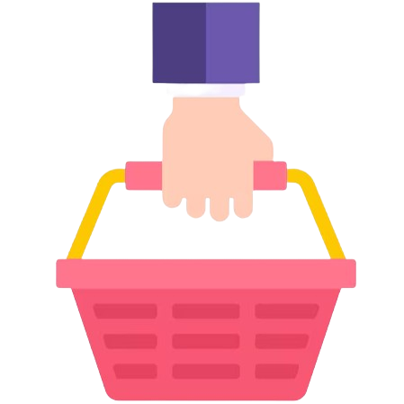

<div align="center">
<br><br>


# Lista de Compras Interativa
</div>

<div align="center">

<p align="center">
  <a href="#descrição-do-projeto">Descrição</a> •
  <a href="#tecnologias-utilizadas">Tecnologias</a> •
  <a href="#estrutura-do-projeto">Estrutura</a> •
  <a href="#aprendizado">Aprendizado</a> •
  <a href="#autoria">Autoria</a> •
  <a href="#contribua">Contribuições</a>
</p>
</div>

##  Descrição do Projeto

Este projeto consiste em uma aplicação web simples de lista de compras, desenvolvida com HTML, CSS e JavaScript. Foi desenvolvido como projeto prático do curso  <b><i>JavaScript: construindo páginas dinâmicas</b></i> da Formação <b>Desenvolvimento Front-end</b> da Alura.

## ***Layout***
<div align="center">

</div>

##  *Funcionalidades da aplicação*

A aplicação permite aos usuários:

- ***Adicionar itens:*** Adicionar novos itens à lista de compras.
- ***Marcar itens como comprados:*** Marcar itens como comprados para facilitar a organização.
- ***Remover a confirmação de compra:*** Desmarcar itens que já foram marcados como comprados.
- ***Editar itens:*** Alterar o nome dos itens da lista.
- ***Excluir itens:*** Remover itens da lista.
- ***Visualizar data e hora de criação dos itens:*** Acompanhar quando cada item foi adicionado à lista.

## 🔎 Tecnologias Utilizadas

<div width="100%" align="center">
<p>&nbsp&nbsp&nbsp&nbsp&nbsp&nbsp&nbsp<b>HTML</b>&nbsp&nbsp&nbsp&nbsp&nbsp&nbsp&nbsp&nbsp&nbsp&nbsp&nbsp&nbsp<b>CSS</b>&nbsp&nbsp&nbsp&nbsp&nbsp&nbsp&nbsp<b>JavaScript</b>&nbsp&nbsp&nbsp&nbsp&nbsp&nbsp&nbsp&nbsp<b>GIT</b><br>&nbsp&nbsp&nbsp&nbsp&nbsp&nbsp&nbsp&nbsp&nbsp&nbsp &nbsp&nbsp&nbsp&nbsp&nbsp&nbsp&nbsp&nbsp
&nbsp&nbsp&nbsp&nbsp&nbsp&nbsp&nbsp&nbsp
&nbsp&nbsp&nbsp&nbsp&nbsp&nbsp&nbsp&nbsp

<br></p>
</div>
<br>
<p>&nbsp&nbsp&nbsp&nbsp&nbsp&nbsp&nbsp&nbsp&nbsp&nbsp&nbsp&nbsp <b>HTML5:</b> Estrutura básica da página e dos elementos da lista.</p> 
<p>&nbsp&nbsp&nbsp&nbsp&nbsp&nbsp&nbsp&nbsp&nbsp&nbsp&nbsp&nbsp <b>CSS3:</b>  Estilização da interface, criando uma aparência visualmente agradável.</p>

<p>&nbsp&nbsp&nbsp&nbsp&nbsp&nbsp&nbsp&nbsp&nbsp&nbsp&nbsp&nbsp <b>JavaScript: </b>Implementação da lógica, que realiza as ações para manipular a lista de compras, adicionar, remover e editar itens, além de atualizar a interface em tempo real.</p>
  


## 👷🏼‍♂️ Estrutura do Projeto

Abaixo os diretórios e arquivos do projeto e suas descrições:

|Nome|Tipo|Descrição|
|---|---|---|
***index.html***|Arquivo|Arquivo principal que contém os elementos que compõem a página.|
**CSS**|Pasta| Diretório que contém os arquivos de definição de estilo da página do aplicativo|
**IMG**| Pasta |Diretório onde estão as imagens utilizadas no aplicativo|
**JS**|Pasta|Diretório que agrupa os arquivos de lógicas das funcionalidades implementadas na aplicação|
***style.css***|Arquivo| Arquivo CSS responsável pela estilização da página.
***script.js***| Arquivo| Arquivo JavaScript que contém a lógica da aplicação.
**README**|Pasta| Diretório onde estão dispostas as imagens utilizadas no arquivo Readme do projeto.|
***readme.md***|Arquivo| Arquivo que contém as informações acerca do projeto|


## ▶️ Como Executar o Projeto
Existem duas formas de visualizar uma demonstração do projeto:

1 - Acessar diretamente no seu navegador, clicando no link <a href="https://devgirlaos40.github.io/ListaDeCompras/">http://devgirlaos40.github.io/ListaDeCompras/</a>

2 - Baixar o código e executar em seu computador:<br>
*   Clone o repositório: <br>

    *   ```git clone https://devgirlaos40/ListaDeCompras.git```
*   Abra o arquivo index: 
    *   clique no arquivo ```index.html``` com o botão direito do mouse
    *   selecione a opção ```Abrir Com...```
    *   na lista de programas, selecione o seu navegador preferido
    *   clique em ```Abrir```


## 🧠 Aprendizado

### ➕ Novas habilidades:

Ao desenvolver este projeto, pude conhecer os seguintes recursos do <u>Javascript</u>:

*   ***Manipulação do DOM***: Adicionar, remover e modificar elementos HTML para atualizar a lista de compras dinamicamente.

*   ***Eventos***: Utilizar eventos como click para capturar interações do usuário e executar as funções correspondentes.

*   ***Funções***: Criar funções para encapsular as diferentes funcionalidades da aplicação, como adicionar item, marcar como comprado, etc.

*   ***Variáveis***: Utilizar variáveis let e const para armazenar dados como a lista de itens, o elemento HTML da lista, etc.

*   ***Data e hora***: Utilizar o método new Date() para registrar a data e hora de criação de cada item.

*   ***Módulos***: Organizar o código em módulos utilizando import e export para facilitar a manutenção e reutilização de funcionalidades.

### ✔️ Prática:

Pude também praticar e me aprofundar nas habilidades já adquiridas em <u>HTML</u> e <u>CSS</u> de ***Construir interfaces web interativas*** para criar aplicações dinâmicas.

## 👣 Próximos Passos
Este projeto serve como base para explorar conceitos mais avançados em desenvolvimento web, como:

*   ***Frameworks***: React, Angular, Vue.js
*   ***Bibliotecas***: jQuery
*   ***Banco de dados***: Armazenar a lista de compras em um banco de dados local ou remoto.

## 👩🏻‍💻 Autoria

O projeto foi desenvolvido pela equipe de instrutores Front-End da Alura, para o curso ***Javascript: contruindo páginas dinâmicas*** da Formação ***Desenvolvimento Front-end: cursos para criar aplicações web com HTML, CSS e JavaScript***.

# 🕵🏻‍♀️Contribua

Este projeto foi desenvolvido com muito carinho e dedicação. Espero que você tenha gostado! <br><br>
Se você encontrar algum bug ou tiver alguma sugestão, por favor, abra um issue. <br><br>
Contribuições são mais do que bem-vindas! <br><br>
No futuro, planejo adicionar ao projeto:
*  Pesquisar item da lista
*  Alterar o tema
*  Melhorar a acessibilidade.<br><br>

E aí, qual a sua próxima ideia para este projeto?

<br><br><br>
